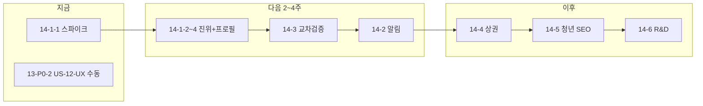

# 지원둥지 — Planner Scratchpad

**역할**: Planner 주도 계획 / Executor는 사용자 승인 후 단계별 실행  
**기준 문서**: `policyfund_v2_prd_v2_0_free_plan_db_switch_ready.md` (PF-WEB-001 v2.0, 2026-05-11) — 문서 내 과거 명칭 PolicyFund AI는 제품 코드명 참고용이며, **사용자 노출 브랜드는 지원둥지**로 통일함 (2026-05-16).  
**UI 목업 기준**: `KakaoTalk_Photo_2026-05-11-18-15-52 001.png` (관리자 대시보드), `KakaoTalk_Photo_2026-05-11-18-15-53 002.png` (사용자 홈)  
**Planner 최종 갱신**: 2026-05-17 (Phase 14 공공데이터·신뢰 로드맵 — Planner)  
**현재 모드**: **Planner** — Executor 착수 전 사용자 승인 대기

### 홈 UI 목업 정합 (2026-05-17 Executor)
- 사용자 피드백: 배포/로컬 화면이 제안 목업(안 A / B+C)과 시각적으로 크게 다름
- 조치: `HomeProgramRichCard`, 히어로 2열+일러스트, 로그인 히어로(진단 3단계 미리보기·프로필 필드 카드), 매칭% 표시 보정(프로필 맞춤 시 88%+), GeoSourceSummary 히어로→하단 이동

---

## Background and Motivation

PolicyFund AI v2는 기존 GitHub Pages 단일페이지 MVP(`policyfundapp`)의 구조적 한계를 해소하는 **신규 웹서비스 개발** 프로젝트다.

### 기존 MVP의 핵심 문제점

| 우선순위 | 문제 | 영향 |
|---|---|---|
| 긴급 | Anthropic API Key 프론트 노출 시도 | 보안 취약 |
| 긴급 | CORS로 LLM 호출 실패 → 전원 fallback 결과 | 서비스 신뢰도 0 |
| 높음 | 실제 공고 데이터 없음 → 가상 결과 | 사용자 오도 위험 |
| 높음 | `debtRatio` 하드코딩 200 | 결과 차별화 불가 |

### 신규 서비스 핵심 가치

- **실제 공공 API 기반**: 기업마당 · K-Startup · 중소벤처24 연동
- **서버 전용 보안**: 모든 API 키는 Next.js API Routes에서만 사용
- **LLM 역할 제한**: 조건 추출 + 설명 보완에만 사용 (공고 생성·검색 금지)
- **무료 플랜 기반 운영**: Vercel Hobby + Supabase Free (500MB 한도 내 설계)
- **원클릭 DB 전환 구조**: `api_minimal_cache` → `db_centric` 모드 전환 준비

### Phase 12 배경 (2026-05-17 — 불특정 다수 오픈·실사용 피드백)

- 프로덕션(`policyfund-zeta.vercel.app`)에서 **진단 조건(서울·소프트웨어·3년)** 과 **검색 결과(업종 완화·뷰티 공고·업종 불일치 배지)** 가 어긋나 신뢰 이슈가 보고됨.
- 1차 수정 완료: 업종 `toCanonicalIndustry`, 업력 `3년` 파싱·`missing_important` 정합, `verify:strict` 안정화 (`c4691c3` 등).
- **다음 목표**: “0건 방지용 자동 완화”를 **사용자가 이해·선택**할 수 있게 하고, 데이터·랭킹·프로필로 **맞는 공고가 위로** 오게 고도화. → **Phase 12로 달성(2026-05-17)**

### Phase 13 배경 (2026-05-17 — 고도화 제안 정리·우선순위 확정)

- Phase 12 완료 후 남은 과제: **유입(SEO)·검색 신뢰 잔여(업종 탭)·재방문(찜·알림)·모바일·운영 루틴·장기 인프라**.
- 사용자 요청: 구글 「지원둥지」 검색 미노출 → **canonical/sitemap이 배포별 URL**을 가리키던 문제 확인. Executor가 `getSiteUrl`·dynamic robots/sitemap·llms/ai 라우트 수정(**미배포·미커밋 가능** — Executor 피드백 참고).
- 원칙 유지: 기능 폭 확대보다 **신뢰·설명 가능성·유입** 우선. Executor는 **태스크 1개씩**, 완료 후 사용자 검증.

### Phase 14 배경 (2026-05-17 — 공공데이터·신뢰 로드맵, Planner)

사용자가 공유한 **「추천 로드맵 (지원둥지에 맞춤)」** 을 Phase 14로 공식화한다. 기존 Phase 13(성장·SEO·찜·알림)과 **병행 가능하나 Executor는 한 번에 14-x-1 태스크만** 수행한다.

| 순서 | 기능 | 기대 효과 | Phase 13과 관계 |
|:---:|---|---|---|
| **14-1** | 사업자 진위확인 + 프로필 자동화 | 홈 UX·자격판정 신뢰 동시 개선 | 13-P1-3(프로필) 확장 |
| **14-2** | 마감/신규 알림 (`alert_profiles`) | 로그인 유저 재방문 | = 13-P2-2 (동일 스코프) |
| **14-3** | 기업마당 목록 파일 ↔ DB 교차검증 | 가짜/누락 공고 신뢰 | 신규 (운영·데이터) |
| **14-4** | 상권정보 API | 소상공·지역 매칭 차별화 | 신규 (선택·후순위) |
| **14-5** | 온통청년 API | 청년 세그먼트 랜딩·SEO | 신규 (마케팅) |
| **14-6** | 벤처/이노비즈 + R&D 공고원 | 고급 사용자·객단가 | 신규 (장기) |

**인프라 전제 (변경 없음)**  
- Supabase Free **500MB**, Vercel **Cron** (Hobby 한도)  
- 공고 **원문 전문 DB 저장 금지**, 사용자 요청 시 **대량 실시간 공공 API 호출 금지**  
- PRD 원칙 유지: **서버 캐시 + 핵심 필드만 저장**, 동기화는 배치·upsert

**최근 UX 기반선 (Executor 완료, Phase 14 설계에 반영)**  
- 베타 `BETA_ALL_ACCESS`, 검색 `empty_state`·`requested_filters`, parse 조사·마감 문구 — **14-1**에서 「검증된 프로필」과 연결

---

## Key Challenges and Analysis

1. **무료 플랜 한도**: Supabase Free 500MB 초과 시 read-only 트리거 — 공고 원문 전체 저장 금지, 핵심 필드만 저장
2. **공공 API 안정성**: 기업마당/K-Startup은 즉시 사용 가능, 중소벤처24는 서버 IP 등록 필요 → Phase 후반 활성화
3. **LLM 환각 방지**: 자격판정 상태값(`likely_eligible` 등)은 룰 엔진이 결정, LLM은 설명 문구만 생성
4. **데이터 운영 이원화**: 현재 `api_minimal_cache` → 향후 유료 전환 시 `db_centric` 원클릭 전환 구조 필수
5. **표준 필드명 통일**: 자연어 입력·API 요청·DB 간 필드명 혼재 방지 (`bizAge` → `business_age_years` 등)
6. **반복 오류 재발**: 수동 점검만으로는 동일 결함이 다른 경로에서 재출현하므로, 로그 표준화+회귀 테스트가 필요
7. **검색 매칭 한계 (Phase 12)**: `unifiedSearch` 업종 필터는 `ilike` 텍스트 매칭 → 공고 `industry` 미기재·오기재 시 0건 → `drop_industry` 완화 → 무관 공고 노출
8. **진단·검색 단절**: `/diagnosis?data=` URL 인코딩 JSON은 길이·캐시·구버전 파싱 결과가 남을 수 있음
9. **자격판정 설명 부족**: `failed`/`unknown` 이유가 카드에 한 줄로 안 보이면 “검색이 틀렸다”로 오해
10. **무료 플랜·다수 이용**: parse/search 레이트리밋·LLM 비용·동기화 품질을 운영 지표로 보지 않으면 장애 시 전원 fallback

### Phase 14 — Key Challenges (Planner, 2026-05-17)

1. **사업자 진위확인 API**: 키 발급 주체(공공데이터포털·국세청 등), **개인정보·사업자번호** 처리, 로그인 사용자만 호출, 결과 **캐시 TTL**(예 24h) 필요. 프론트에 사업자번호 직접 저장 최소화.
2. **프로필 자동화 vs 사용자 통제**: 진위확인 성공 시 `business_profiles` 자동 채움은 편의 ↑, 오인 시 신뢰 ↓ → **미리보기·수정 후 저장** UI 필수.
3. **교차검증(14-3)**: 기업마당 **목록 파일/API**와 `support_programs` diff — 누락·중복·`external_id` 불일치. 관리자 대시보드에만 노출, 사용자 API 부하 없음.
4. **알림(14-2)**: `alert_profiles` 테이블은 PRD·`database.types`에 존재. Cron 일 1회 배치가 Free 한도에 안전. 이메일 1차(Resend/Supabase Auth 메일 재사용 검토).
5. **상권·청년·R&D(14-4~6)**: 검색 핵심 경로에 넣지 말고 **보조 신호·랜딩·Pro 기능**으로 격리 — 500MB·latency 방지.
6. **Phase 13과 순서 충돌**: 13-P0-2(US-12-UX 수동), GSC는 유지. **Executor 첫 착수 권장 = 14-1-1**(스파이크) 또는 사용자가 고른 14-x-1.

### 반복 오류 방지 전략 (Planner 확정)

- API 오류 응답 표준: `error_code`, `trace_id`, `step`, `message`를 공통 필드로 반환
- 사용자 여정 단계 로그: 홈→진단→검색→상세→자격판정→문서생성 단계별 핵심 분기 기록
- 회귀 테스트 의무화: 버그 1건 수정 시 해당 재현 케이스 테스트 1건 추가
- 배포 게이트 강화: 빌드 성공 + 핵심 유저스토리 자동 검증 통과 시 배포

---

## 재분석 결과 — 현재 저장소 상태 (2026-05-15 기준)

### 커밋 이력

| 커밋 | 내용 | 날짜 |
|---|---|---|
| `05b5837` | docs(readme): 버전 정책 및 변경 이력(0.1.0–0.1.1) 추가 | 2026-05-09 |
| `e6f2cec` | docs: Executor 피드백에 초기 푸시 기록 추가 | 2026-05-09 |
| `ef7f9bf` | chore: 초기 계획 문서 및 환경 변수 예시 추가 | 2026-05-09 |

→ **3개 커밋 모두 문서/설정 전용. 실제 Next.js 앱 코드 없음.**

### 로컬 미커밋 변경사항

| 파일 | 상태 | 비고 |
|---|---|---|
| `.cursor/scratchpad.md` | modified | 2026-05-11 재작성, 미커밋 |
| `README.md` | **deleted** | 로컬에서 삭제됨, 미커밋 — 복구 또는 재작성 필요 |
| `KakaoTalk_Photo_2026-05-11-18-15-52 001.png` | untracked | 관리자 UI 목업 이미지 |
| `KakaoTalk_Photo_2026-05-11-18-15-53 002.png` | untracked | 사용자 홈 UI 목업 이미지 |
| `policyfund_v2_prd_v2_0_free_plan_db_switch_ready.md` | untracked | PRD v2.0 — 미커밋 |

### `.env.example` 현재 상태 (확인 완료)

```env
BIZINFO_API_KEY=
PUBLIC_DATA_SERVICE_KEY=
SMES24_API_KEY=
SMES24_API_BASE=https://www.smes.go.kr/fnct/apiReqst/extPblancInfo
SMES24_DEFAULT_STRDT=
SMES24_DEFAULT_ENDDT=
ANTHROPIC_API_KEY=
SUPABASE_URL=
SUPABASE_SERVICE_ROLE_KEY=
NEXT_PUBLIC_SUPABASE_URL=
NEXT_PUBLIC_SUPABASE_ANON_KEY=
NEXT_PUBLIC_APP_URL=http://localhost:3000
CRON_SECRET=
GOV_MCP_JSON_PRETTY=
PAYMENT_SECRET_KEY=
```

→ PRD §10과 대체로 일치. **SMES24 관련 변수 3개가 PRD보다 상세하게 이미 추가되어 있음.**

### 결론: 현재 개발 착수 전 상태

- 계획 문서(PRD v2.0, 목업 2장, scratchpad)는 완비
- Next.js 앱 코드는 전무 — Phase 1 스캐폴딩 착수 필요
- README.md 삭제 상태 — Phase 1 완료 시점에 함께 재작성 권장

---

## 확정된 설계 원칙 (PRD v2.0 기준)

### 데이터 운영 모드

| 모드 | 설명 | 사용 시점 |
|---|---|---|
| `api_minimal_cache` | 공공 API 조회 + 최소 캐시만 Supabase 저장 | **현재 v1 (무료 플랜)** |
| `db_centric` | 공공 API 전체 정기 수집 후 DB 중심 검색 | 유료 플랜 전환 후 |

### 라우트 구조 (정본)

| 화면 | 경로 | App Router 파일 |
|---|---|---|
| 홈 (자연어 검색 + 추천 배너) | `/` | `app/page.tsx` |
| 조건 확인 · 보완 | `/diagnosis` | `app/diagnosis/page.tsx` |
| 빠른 AI 진단 결과 | `/report/quick` | `app/report/quick/page.tsx` |
| 실제 공고 검색 결과 | `/search` | `app/search/page.tsx` |
| 공고 상세 | `/search/[id]` | `app/search/[id]/page.tsx` |
| 계획서 생성 | `/documents/plan` | `app/documents/plan/page.tsx` |
| 심사 점수 예측 | `/evaluate` | `app/evaluate/page.tsx` |
| 내 신청 관리 | `/manage` | `app/manage/page.tsx` |
| 서비스 소개 | `/about` | `app/about/page.tsx` |
| 이용안내 | `/guide` | `app/guide/page.tsx` |
| 요금제 | `/pricing` | `app/pricing/page.tsx` |
| 이용약관 | `/terms` | `app/terms/page.tsx` |
| 개인정보처리방침 | `/privacy` | `app/privacy/page.tsx` |
| 법적 고지 | `/disclaimer` | `app/disclaimer/page.tsx` |
| 환불정책 | `/refund-policy` | `app/refund-policy/page.tsx` |
| 고객센터 | `/contact` | `app/contact/page.tsx` |
| FAQ | `/faq` | `app/faq/page.tsx` |
| 로그인 | `/login` | `app/login/page.tsx` |
| 회원가입 | `/signup` | `app/signup/page.tsx` |
| 마이페이지 | `/mypage` | `app/mypage/page.tsx` |
| 관리자 대시보드 | `/admin` | `app/admin/page.tsx` |

### 표준 CompanyProfile 필드 (API·DB 공통)

| 표준 필드명 | 타입 | 설명 |
|---|---|---|
| `region` | string | 지역 (예: "경기도") |
| `city` | string \| null | 시·군·구 |
| `industry` | string | 업종 |
| `business_age_years` | number \| null | 업력 (년) |
| `employee_count` | number \| null | 직원 수 |
| `annual_revenue_krw` | number \| null | 연매출 (원 단위 정수) |
| `credit_score` | number \| null | 신용점수 |
| `tax_arrears` | boolean \| null | 세금 체납 여부 |
| `desired_amount_krw` | number \| null | 신청 희망 금액 (원 단위 정수) |
| `support_purpose` | string \| null | 지원 목적 |
| `business_type` | string \| null | 개인/법인 구분 |
| `startup_stage` | string \| null | 창업 단계 |

### 핵심 API Route 목록

| Route | Method | 설명 |
|---|---|---|
| `/api/query/parse` | POST | 자연어 → 조건 추출 (LLM) |
| `/api/search` | POST | DB/공공 API 기반 공고 검색 |
| `/api/programs/[id]` | GET | 공고 상세 조회 |
| `/api/home/recommendations` | GET/POST | 홈 AI 추천 배너 데이터 |
| `/api/programs/trending` | GET | 마감임박·신규·인기 공고 |
| `/api/eligibility` | POST | 룰 기반 자격판정 |
| `/api/documents/checklist` | POST | 서류 체크리스트 생성 |
| `/api/documents/timeline` | POST | 신청 타임라인 생성 |
| `/api/documents/plan` | POST | 사업계획서 초안 생성 |
| `/api/evaluate/startup` | POST | 심사 점수 예측 |
| `/api/evaluate/quality` | POST | 계획서 품질 측정 |
| `/api/export/csv` | POST | CSV 파일 생성 |
| `/api/export/xlsx` | POST | XLSX 파일 생성 |
| `/api/admin/sync` | POST | 공고 동기화 (Cron + 수동) |
| `/api/admin/dashboard` | GET | 관리자 KPI 데이터 |
| `/api/admin/programs` | GET | 관리자 공고 목록 |
| `/api/admin/programs/[id]` | GET/PATCH | 공고 상세/상태 수정 |
| `/api/admin/recommendations/home-slots` | GET/PATCH | 홈 배너 슬롯 관리 |
| `/api/contact` | POST | 고객 문의 접수 |
| `/api/feedback` | POST | 피드백 수집 |

---

## High-level Task Breakdown

각 Phase는 **한 번에 하나만** Executor가 수행하고, 성공 기준 충족 후 사용자 검증 후 다음 단계로 진행한다.

---

### Phase 1 — 프로젝트 기반 구축 ✅ **완료** (2026-05-15)

**목표**: Next.js 앱 스캐폴딩 + Vercel 배포 + Supabase 연결 + README 재작성

#### 태스크

- [x] **1-1** `create-next-app` 실행 (Next.js 16.2.6 · App Router · TypeScript · Tailwind v4)
- [x] **1-2** shadcn/ui v4 초기화 및 기본 컴포넌트 설치 (Button, Card, Input, Badge, Dialog 등 13개)
- [x] **1-3** `.env.example` 검토 완료, `.env.local` 생성 (Supabase anon key 등록)
- [x] **1-4** `lib/supabase/client.ts`, `server.ts`, `admin.ts` 생성 + Supabase 프로젝트 생성 (hwqsxarzgodpsvwahzae, ap-northeast-2)
- [x] **1-5** 공통 레이아웃 `Header.tsx` · `Footer.tsx` + 21개 페이지 플레이스홀더 생성
- [ ] **1-6** Vercel 프로젝트 연결 + 환경변수 등록 + 첫 배포 성공 확인 ← **사용자 확인 필요**
- [x] **1-7** `README.md` 재작성 (PRD v2.0 기준, v0.2.0 변경 이력 포함)
- [ ] **1-8** 변경사항 커밋 (`v0.2.0` 마일스톤 태깅) ← **사용자 확인 후 진행**

**성공 기준**
- ✅ `npm run build` 성공 (21개 페이지 빌드 확인)
- ⬜ Vercel 배포 URL에서 홈 화면 노출 확인
- ✅ `README.md` 존재 (삭제 상태 해소)
- ✅ Supabase 프로젝트 생성 + anon key 연결 확인

---

### Phase 2 — 핵심 DB 스키마 구축

**목표**: Supabase에 서비스 운영에 필요한 핵심 테이블 마이그레이션

#### 태스크

- [ ] **2-1** `support_programs` 테이블 생성 + 검색용 인덱스 (status, visibility_status, application_end_date)
- [ ] **2-2** `business_profiles` 테이블 생성
- [ ] **2-3** `diagnoses`, `eligibility_checks`, `generated_documents` 테이블 생성
- [ ] **2-4** `search_sessions`, `search_session_results` 테이블 생성
- [ ] **2-5** `home_recommendation_slots`, `program_impressions` 테이블 생성
- [ ] **2-6** `customer_inquiries`, `feedback`, `policy_documents` 테이블 생성
- [ ] **2-7** `system_settings` 테이블 생성 + `data_mode = 'api_minimal_cache'` 기본값 삽입
- [ ] **2-8** `program_sync_logs`, `api_sync_logs` 테이블 생성
- [ ] **2-9** `file_exports` 테이블 생성
- [ ] **2-10** `admin_activity_logs`, `system_alerts` 테이블 생성
- [ ] **2-11** 전체 테이블 RLS 정책 적용 (PRD §16.10 기준)

**성공 기준**
- Supabase 대시보드에서 전체 테이블 확인
- RLS 적용 확인 (본인 데이터만 접근, 공개 테이블 읽기 허용)
- `system_settings.data_mode = 'api_minimal_cache'` 기본값 확인

---

### Phase 3 — 자연어 검색 UX 핵심 흐름

**목표**: 홈 화면 자연어 검색 → 조건 추출 → 조건 확인 카드 흐름 구현

#### 태스크

- [ ] **3-1** 홈 화면 (`/`) UI 구현 — Hero + 자연어 검색창 + 조건 추출 칩 (목업 002.png 기준)
- [ ] **3-2** `lib/llm/claude.ts`, `lib/query/parseNaturalLanguage.ts` 구현
- [ ] **3-3** `/api/query/parse` 구현 — LLM 자연어 조건 추출 (표준 필드명 기준)
- [ ] **3-4** 조건 확인 카드 UI (`/diagnosis`) — 추출값 확인·수정 + 부족 정보 보완
- [ ] **3-5** 방식 선택 UI — "빠른 AI 진단 (3초)" vs "실제 공고 맞춤 검색 (10~20초)"
- [ ] **3-6** 빠른 AI 진단 결과 화면 (`/report/quick`) — 점수·등급·법적 고지 문구

**성공 기준**
- 자연어 입력 → 조건 추출 → 카드 표시 흐름 E2E 작동
- 추출 조건 수정 가능
- 빠른 진단 결과 화면에 법적 고지 문구 필수 표시
- 금액 표시는 `formatKRW()` 포맷터 적용

---

### Phase 4 — 공고 DB 동기화 + 추천 배너

**목표**: 공공 API 연동 + Supabase 저장 + 홈 추천 배너 실제 데이터 표시

#### 태스크

- [x] **4-1** `lib/gov-support/clients/bizinfo.ts` — 기업마당 API 클라이언트
- [x] **4-2** `lib/gov-support/clients/kstartup.ts` — K-Startup API 클라이언트
- [x] **4-3** `lib/gov-support/core/normalizer.ts` — API 응답 → 표준 필드 정규화 (PRD §19.3)
- [x] **4-4** `lib/gov-support/core/dedup.ts` — Jaccard 유사도(≥0.7) 중복 제거
- [x] **4-5** `/api/admin/sync` — 기업마당+K-Startup 병렬 수집 + upsert + `api_sync_logs` 기록
- [x] **4-6** `/api/home/recommendations` — 30분 ISR 추천 배너 API
- [x] **4-7** `ProgramBannerCard.tsx` — 마감임박 D-day 배지 포함 공고 카드
- [x] **4-8** 홈 화면(`/`) — Suspense + Supabase 직접 쿼리로 실제 공고 배너 통합

**성공 기준**
- 관리자 수동 동기화 1회 후 `support_programs`에 샘플 공고 저장 확인
- 홈 배너에 실제 공고 카드 3~6개 표시 (LLM 생성 공고 없음)
- 배너 조회 조건: `status in ('active','closing_soon') AND visibility_status = 'visible'`

---

### Phase 5 — 실제 공고 검색 + 자격판정

**목표**: DB 기반 공고 검색 + 룰 기반 자격판정 파이프라인

#### 태스크

- [ ] **5-1** `lib/gov-support/tools/unifiedSearch.ts` — 통합 검색 (DB 우선, API fallback)
- [ ] **5-2** `/api/search` — 조건 기반 공고 검색·필터·정렬 + `search_sessions` 저장
- [ ] **5-3** 공고 검색 결과 화면 (`/search`) — 카드 목록 + 자격 상태 배지
- [ ] **5-4** `lib/gov-support/tools/eligibility.ts` — 룰 기반 자격판정 엔진 (PRD §21.5 기준)
- [ ] **5-5** `/api/eligibility` — 룰 판정 + LLM 설명 보완 + `eligibility_checks` 저장
- [ ] **5-6** 공고 상세 화면 (`/search/[id]`) — 공고 정보 + 자격판정 결과 + 법적 고지

**성공 기준**
- 조건 입력 → 공고 목록 + `likely_eligible` / `review_needed` / `likely_ineligible` / `unknown` 배지 표시
- LLM이 자격판정 상태값을 직접 결정하지 않음 (룰 엔진 결정 후 LLM 설명만)
- 모든 결과 화면에 법적 고지 문구 표시

---

### Phase 6 — 서류·타임라인·사업계획서 생성

**목표**: 공고 선택 후 신청 준비 문서 일괄 생성 + `generated_documents` 저장

#### 태스크

- [ ] **6-1** `lib/gov-support/tools/documentChecklist.ts` — 표준 서류 DB(15종) 매칭
- [ ] **6-2** `lib/gov-support/tools/timeline.ts` — 마감일 역산 9단계 타임라인
- [ ] **6-3** `lib/gov-support/tools/draftTools.ts` — 사업계획서 초안 (`gov` / `psst` 템플릿)
- [ ] **6-4** `/api/documents/checklist`, `/api/documents/timeline`, `/api/documents/plan` 구현
- [ ] **6-5** 계획서 생성 화면 (`/documents/plan`) — 템플릿 선택 + 생성 + 미리보기
- [ ] **6-6** `generated_documents` 저장

**성공 기준**
- 공고 선택 → 서류 체크리스트·타임라인·계획서 초안 각 1건 생성·저장 확인
- gov 템플릿(6섹션 공문서) / psst 템플릿(PSST 4축 12소섹션) 각각 작동

---

### Phase 7 — 심사 점수 예측 + CSV/XLSX 내보내기

**목표**: 계획서 품질 측정 → 심사 점수 예측 → 파일 내보내기

#### 태스크

- [ ] **7-1** `lib/gov-support/tools/assessQuality.ts` — PSST 품질 측정 (30/30/20/20)
- [ ] **7-2** `lib/gov-support/tools/evaluateStartup.ts` — 루브릭 심사 점수 (100점 + 가점 5점)
- [ ] **7-3** `/api/evaluate/quality`, `/api/evaluate/startup` 구현
- [ ] **7-4** 심사 점수 예측 화면 (`/evaluate`) — 루브릭 점수 + 보완 코멘트 + 예상 질문
- [ ] **7-5** `/api/export/csv`, `/api/export/xlsx` 구현 (Google Sheets API 미사용)
- [ ] **7-6** `file_exports` 저장 + 24시간 만료 처리

**성공 기준**
- 계획서 → 품질 점수 → 심사 점수 예측 순서 E2E 재현
- CSV/XLSX 다운로드 작동 확인
- Google Sheets API 미사용 확인

---

### Phase 8 — 운영 필수 페이지 + 관리자 MVP

**목표**: 법적 필수 페이지 전체 + 관리자 콘솔 기본 기능 (목업 001.png 기준)

#### 태스크

- [ ] **8-1** `/about`, `/guide`, `/terms`, `/privacy`, `/disclaimer`, `/refund-policy`, `/contact`, `/faq` 페이지 구현
- [ ] **8-2** 관리자 공통 레이아웃 (좌측 사이드바 + 상단 헤더, 목업 001.png 기준)
- [ ] **8-3** 관리자 대시보드 KPI 카드 (`/admin/dashboard`) — 총 공고수·동기화·배너 노출·문의·결제·오류
- [ ] **8-4** 공고 QA 목록·상세·동기화 관리 (`/admin/programs/*`)
- [ ] **8-5** 홈 추천 배너 슬롯 관리 (`/admin/recommendations/home-slots`)
- [ ] **8-6** 문의·피드백 관리 (`/admin/inquiries`, `/admin/feedback`)
- [ ] **8-7** 콘텐츠 관리 (`/admin/content/*`) — FAQ·이용안내·정책문서
- [ ] **8-8** 운영 모드 설정 (`/admin/settings`) — `api_minimal_cache` ↔ `db_centric` 전환 UI

**성공 기준**
- 법적 필수 페이지 전체 접근 가능
- 관리자 로그인 후 대시보드 KPI 확인 가능
- 수동 동기화 버튼 작동 + `program_sync_logs` 기록 확인

---

### Phase 9 — 로그인·회원가입·마이페이지

**목표**: Supabase Auth 기반 인증 흐름 + 사용자 프로필 관리

#### 태스크

- [ ] **9-1** 로그인 (`/login`), 회원가입 (`/signup`), 비밀번호 재설정 페이지
- [ ] **9-2** Supabase Auth 이메일/소셜 로그인 연동
- [ ] **9-3** 마이페이지 (`/mypage`) — 프로필·사용량·생성 문서 확인
- [ ] **9-4** 내 신청 관리 (`/manage`) — 관심 공고·알림 프로파일 CRUD

**성공 기준**
- 회원가입 → 로그인 → 마이페이지 E2E 흐름 작동
- `business_profiles` 저장·수정 확인

---

### Phase 10 — 결제·구독 (선택 / 후순위)

**목표**: 요금제 도입 및 결제 연동 (상용 서비스 전환 시)

#### 태스크

- [ ] **10-1** 요금제 화면 (`/pricing`)
- [ ] **10-2** 토스페이먼츠 또는 포트원 결제 연동
- [ ] **10-3** `subscriptions`, `payments`, `usage_events` 운영
- [ ] **10-4** 사용량 제한 미들웨어

**성공 기준**
- 결제 → 구독 상태 업데이트 → 기능 개방 흐름 작동

---

### Phase 11 — 엄격 유저스토리 + 오류 재발 방지 체계 (신규)

**목표**: 반복 오류를 구조적으로 차단하고 동일 결함의 재발을 자동 감지

#### 태스크

- [ ] **11-1** 핵심 유저스토리 15개를 엄격 시나리오(정상/경계/실패)로 고정
- [ ] **11-2** API 오류 표준 스키마 적용 (`error_code`, `trace_id`, `step`)
- [ ] **11-3** 공통 로깅 유틸 추가 + 민감정보 마스킹 규칙 적용
- [ ] **11-4** 과거 반복 버그 회귀 테스트 세트 구축
- [ ] **11-5** E2E 자동화 (검색→진단→자격→문서 여정)
- [ ] **11-6** 배포 전 품질 게이트 스크립트 구축 (`verify:story`)

**성공 기준**
- 동일 오류 재발 시 `trace_id`로 1분 내 역추적 가능
- 핵심 유저스토리 자동 테스트 통과율 100%
- 과거 반복 이슈가 회귀 테스트에서 즉시 탐지

---

## Project Status Board

### 완료

- [x] PRD v2.0 확정 (PF-WEB-001 v2.0, 2026-05-11)
- [x] UI/UX 목업 확정 (관리자 목업 001.png + 사용자 홈 목업 002.png)
- [x] 라우트 구조 확정 (PRD §8.1 기준)
- [x] DB 스키마 설계 확정 (PRD §9 기준, 20+ 테이블)
- [x] 데이터 운영 모드 확정 (`api_minimal_cache` 기본, `db_centric` 전환 준비)
- [x] `.env.example` 작성 완료 (SMES24 상세 변수 포함)
- [x] `.gitignore` 설정 완료
- [x] Git 저장소 초기화 + 원격 연결 (`https://github.com/boam79/policy_fund`)
- [x] Scratchpad Planner 재수립 (2026-05-15)
- [x] **Phase 1** — 프로젝트 기반 구축 완료 (2026-05-15)
  - Next.js 16.2.6 (App Router · TypeScript · Tailwind v4) 스캐폴딩
  - shadcn/ui v4 초기화 (13개 컴포넌트)
  - Supabase 프로젝트 생성 (`hwqsxarzgodpsvwahzae`, ap-northeast-2)
  - `lib/supabase/client.ts`, `server.ts`, `admin.ts` 구현
  - Header · Footer 공통 레이아웃
  - 홈 화면 UI (Hero · 추천 배너 · 4단계 흐름 · CTA)
  - 21개 페이지 플레이스홀더
  - README.md 재작성

### 진행 중

- [ ] **Phase 11-1** — 엄격 유저스토리 15개 정의 (Planner)
- [ ] **Phase 11-2** — 오류 로그 표준 스키마 확정 (Planner)

### 대기 중 (우선순위 순)

- [x] Phase 2 — DB 스키마 구축 ✅ 완료 (2026-05-15)
- [x] Phase 3 — 자연어 검색 UX ✅ 완료 (2026-05-15)
- [x] Phase 4 — 공고 동기화 + 추천 배너 ✅ 완료 (2026-05-15)
- [ ] Phase 5 — 공고 검색 + 자격판정 ← **다음 착수**
- [ ] Phase 6 — 서류·타임라인·계획서 생성
- [ ] Phase 7 — 심사 점수 + CSV/XLSX 내보내기
- [ ] Phase 8 — 운영 필수 페이지 + 관리자 MVP
- [ ] Phase 9 — 인증·마이페이지
- [ ] Phase 10 — 결제·구독 (후순위)
- [ ] Phase 11 — 엄격 유저스토리 + 오류 재발 방지 체계
- [x] **Phase 12 — 서비스 고도화** (Wave 1~5 Executor 완료 2026-05-17, 프로덕션 US-12-UX 스모크 권장)
- [ ] **Phase 13 — 성장·신뢰·운영** (Planner 계획 완료 2026-05-17, 일부 P0·P1 완료)
- [ ] **Phase 14 — 공공데이터·신뢰 로드맵** (Planner 계획 완료 2026-05-17, **사용자 승인 후 14-1-1**부터)

### Phase 14 — Project Status Board (Planner, 로드맵 순)

**Wave A — 신뢰·프로필 (14-1)** ← **Executor 첫 착수 권장**
- [x] 14-1-1 **스파이크**: `docs/phase14-business-verify-spike.md`
- [x] 14-1-2 env·서버 클라이언트: `lib/gov-support/clients/ntsBusinessman.ts` (`PUBLIC_DATA_SERVICE_KEY`)
- [x] 14-1-3 `POST /api/profile/verify-business` (로그인, rate limit, 24h 캐시)
- [x] 14-1-4 마이페이지 `BusinessVerifyCard` (진단 연동·DB verified_at은 미구현)
- [x] ~~14-1-4b 사업자번호 조회 자동 채움~~ **제거** (2026-05-17, FSC API 단건 조회 불가)
- [ ] 14-1-5 자격판정: `verified_at` 배지·`eligibility` unknown 문구에 「미확인 프로필」 구분 (선택)
- [ ] 14-1-6 `verify:story` 또는 `verify:journey`에 mock/스텁 경로 1건

**Wave B — 재방문 (14-2)** (= 13-P2-2 통합)
- [x] 14-2-1 `alert_profiles` CRUD API + RLS 마이그레이션(원격 적용 필요)
- [x] 14-2-2 `/mypage/alerts` UI
- [x] 14-2-3 Cron `/api/cron/alerts` + `vercel.json` (Resend 없으면 로그만)
- [ ] 14-2-4 이메일 템플릿·구독 해지 링크

**Wave C — 데이터 신뢰 (14-3)**
- [x] 14-3-1 API 페이지 샘플 수집 (`collectBizinfoApiIds`, `BIZINFO_VERIFY_MAX_PAGES`)
- [x] 14-3-2 admin API diff (`runBizinfoCrossCheck`)
- [x] 14-3-3 `/admin/programs?view=sync-verify` 「동기화 검증」탭

**Wave D~F — 확장 (14-4~6, 사용자 승인 후)**
- [ ] 14-4-1 상권정보: API 스파이크 → 지역 검색 결과 **참고 카드** 1블록(비동기)
- [ ] 14-5-1 온통청년: `/youth` 랜딩 + sitemap + 수동 큐레이션 링크(초기는 API 최소)
- [ ] 14-6-1 벤처/이노비즈 인증 조회 + R&D 공고 소스 1개 추가(동기화 파이프라인 재사용)

### Phase 13 — Project Status Board (Planner, 우선순위순)

**P0 — 즉시 (유입·신뢰 게이트)**
- [x] 13-P0-1 SEO 코드 (`getSiteUrl`, dynamic robots/sitemap, llms/ai) — **프로덕션 배포·`verify:seo` PASS (2026-05-17)** · GSC 사이트맵 제출은 사용자 협업
- [ ] 13-P0-2 US-12-UX 프로덕션 수동 3건 (UX-01·02·03) — 자동 `verify:story` PASS
- [x] 13-P0-3 검색 UI·API `industry_match`: match / similar / any

**P1 — 1~4주 (핵심 제품)**
- [x] 13-P1-1 `sortSearchResultPrograms` — 업력 soft·마감·지역 가중 정렬
- [x] 13-P1-2 `eligibilityPrimaryReason` unknown/failed·스니펫
- [x] 13-P1-3 `buildEligibilityHref`·`loadLastSearchProfile`·자격 화면 안내
- [x] 13-P1-4 `?data=` → `?sid=` 자동 치환 + `docs/diagnosis-url-legacy.md`
- [x] 13-P1-5 `docs/ops-weekly-quality.md`

**P2 — 1~2개월 (성장)**
- [ ] 13-P2-1 찜(bookmark) DB·API·`/manage` UI
- [ ] 13-P2-2 마감 임박 알림(이메일 1차, 푸시 후순위)
- [ ] 13-P2-3 모바일 하단 탭 네비(검색·진단·찜·마이)
- [ ] 13-P2-4 요금제 한도·혜택 UI 톤 통일(검색·문서·export)
- [ ] 13-P2-5 중소벤처24 프로덕션 IP 등록·플래그 ON
- [ ] 13-P2-6 Playwright E2E 1~2건 + CI 선택 job

**P3 — 이후 (확장·내부)**
- [ ] 13-P3-1 `unifiedSearch`·`useDiagnosisDraft` 리팩터(회귀 테스트 선행)
- [ ] 13-P3-2 `db_centric`·벡터 검색 검토(데이터 축적 후)
- [ ] 13-P3-3 Vercel Pro cron(로컬 launchd 대체)
- [ ] 13-P3-4 Phase 11 잔여(엄격 US 15·오류 로그 표준)

### Phase 12 — Project Status Board (Planner) — ✅ 완료

**Wave 1 — 검색 신뢰**
- [x] 12-1-1 검색 API `search_mode` strict/relaxed
- [x] 12-1-2 검색 UI 완화 배너 + 엄격 재검색
- [x] 12-1-3 applied_filters 상시 표시
- [x] 12-1-4 자격 판정 한 줄 사유
- [x] 12-1-5 verify:story UX-01 시나리오
- [x] 12-1-6 검색 정렬 eligibility.score 반영

**Wave 2 — 진단·자연어**
- [x] 12-2-1 확신도 낮은 필드 스테퍼 UI (추출 카드 + 누락 영역 업력·직원)
- [x] 12-2-2 확인 칩 3종 + 「이대로 실제 공고 검색」
- [x] 12-2-3 parse 실패 미니 폼 3필드 → `/search`
- [x] 12-2-4 `?sid=` 세션 API + SearchBar 폴백 `data=`
- [x] 12-2-5 verify:journey 진단→검색 assert (session은 DB 없으면 skip)

**Wave 3 — 데이터·매칭**
- [x] 12-3-1 industry_tags 마이그레이션 (Supabase MCP 적용)
- [x] 12-3-2 동기화·`tag:industry` 배치 태깅
- [x] 12-3-3 unifiedSearch `industry_tags.cs` + ilike OR
- [x] 12-3-4 `parseBusinessAgeConstraints` + eligibility 연동
- [x] 12-3-5 `/api/admin/programs/quality` + 관리자 UI 카드
- [x] 12-3-6 `/api/admin/programs/duplicates` 읽기 전용

**Wave 4 — 개인화·요금**
- [x] 12-4-1 프로필 → 홈·검색 URL 프리필 (`buildSearchUrlFromProfile`)
- [x] 12-4-2 무료 일일 parse 20·search 50 (`PARSE_QUOTA_EXCEEDED` / `SEARCH_QUOTA_EXCEEDED`)
- [x] 12-4-3 Starter+ strict·export 게이트 (`/api/billing/entitlements`)
- [x] 12-4-4 마이페이지 「저장한 조건으로 공고 검색」

**Wave 5 — 성능·운영**
- [x] 12-5-1 parse 캐시 (`lib/query/parseCache.ts`, 24h·동일 질의 `cached: true`)
- [x] 12-5-2 검색 source UI (DB / API 보조 배지)
- [x] 12-5-3 verify:parse-rate CI 문서 (README·`verify:strict` 분리)
- [x] 12-5-4 마감 공고 기본 숨김 + 「마감 포함」 (`include_closed`)

---

## Current Status / Progress Tracking

- **현재 모드**: **Planner** — Phase 14 로드맵 계획 반영 완료(2026-05-17). **다음**: 사용자가 14-1-1(스파이크) 또는 다른 Wave 승인 → Executor 1태스크.
- **저장소**: `https://github.com/boam79/policy_fund` · 로컬 `/Users/parkjaemin/Dev/policy_fund`
- **최신 커밋**: `6fb3923` (검색 0건 UX) · `8246ead` (베타·마감·parse) · **릴리스 태그**: `v0.2.1` (Phase 12)
- **Supabase 프로젝트**: `hwqsxarzgodpsvwahzae` (policyfund-ai-v2, ap-northeast-2, Free Plan)
- **데이터 운영 모드**: `api_minimal_cache`
- **Gemini API Key**: ✅ `.env.local`에 등록 완료
- **빌드 상태**: ✅ `npm run build` 성공 (25개 페이지, 30분 ISR)
- **공공 API 키 필요**:
  - `BIZINFO_API_KEY` — 기업마당 API 키 (bizinfo.go.kr 발급)
  - `PUBLIC_DATA_SERVICE_KEY` — K-Startup / 공공데이터포털 키 (data.go.kr 발급)
- **동기화 실행 방법**: `POST /api/admin/sync` (Authorization: Bearer dev-secret-2026)
- **다음 마일스톤**: v0.2.1 태그·프로덕션 스모크 ✅ (2026-05-17). 이후: GitHub Release 노트·선택 US-12-UX 브라우저 확인
- **Phase 12 Planner 완료일**: 2026-05-17
- **2026-05-15 추가**: 공공 API 연동 보강 진행
  - K-Startup 엔드포인트를 `B552735/kisedKstartupService01/getAnnouncementInformation01`로 수정
  - 중소벤처24 기본 조회기간을 당월 기준으로 조정 + 타임아웃 시 최근 14일 재시도
  - 최신 로컬 동기화 결과: 기업마당 600건, K-Startup 10건, 중소벤처24 1035건, 업서트 127건, 오류 0건
- **2026-05-15 Planner 전환**: 반복 오류 재발 방지를 최우선 목표로 설정
  - 기능 확장보다 `오류 로그 표준화 + 엄격 유저스토리 회귀 테스트`를 선행
  - 즉시 다음 작업: Phase 11-1/11-2
- **2026-05-15 Executor 진행**: Phase 11-2 1차 구현 완료
  - 공통 유틸 추가: `lib/errors/apiError.ts` (`error_code`, `trace_id`, `step`, 표준 오류 응답)
  - 적용 API: `/api/query/parse`, `/api/search`, `/api/eligibility`, `/api/documents/checklist`, `/api/documents/timeline`, `/api/documents/plan`
  - 표준 오류 응답 및 `x-trace-id` 헤더 검증 완료 (로컬 3004 서버)
  - `verify:story` 자동 검증 스크립트 추가 (`scripts/verify-story.ts`) 및 PASS 확인
  - `verify:story`를 엄격 시나리오로 확장 (parse/search/eligibility/documents/admin/export/billing/webhook/rate-limit)
  - 확장 검증 PASS + `npm run build` PASS
  - 관리자 스토리 검증 스크립트 추가: `scripts/verify-admin-story.ts`
  - `verify:admin`, `verify:strict` 명령 추가 및 PASS 확인

---

## Executor's Feedback or Assistance Requests

- **2026-05-17 (Executor)**: **실질적 전부 동기화 정책** — `syncPolicy.ts`, `runProgramSync.ts`, 로컬 `npm run sync` totCnt 전량·Vercel 출처별 상한(기본 10p)·검증 16p·관리자 `/admin/sync` UI. `npm run build` PASS. **미커밋**.
- **2026-05-17 (Executor)**: **사업자번호 자동 채움 기능 제거** — FSC 15108168은 통계용(번호 단건 조회 불가). `BusinessLookupCard`, `lookup-business` API, FSC 클라이언트·문서·스크립트 삭제. 마이페이지는 수동 입력만.
- **2026-05-18 (Executor)**: **Supabase MCP** — `phase14_alerts_rls` 원격 적용 완료(`20260518042619`). 컬럼·RLS 정책 확인. **Vercel MCP** — `441fc7c` 프로덕션 READY (`policyfund-zeta.vercel.app`). Production env에 `CRON_SECRET`·`PUBLIC_DATA_SERVICE_KEY`·`BIZINFO_API_KEY` 있음. `RESEND_API_KEY` 없음 → 알림 cron은 로그만.
- **2026-05-17 (Planner)**: Phase 14 로드맵(사용자 공유 6항목) scratchpad 반영. **Executor 대기** — 사용자 승인·위 3가지 결정 후 **14-1-1** 착수. Phase 13 `13-P0-2` US-12-UX·GSC는 병행 가능(비개발).
- **2026-05-17 (Executor)**: **검색 0건 UX** — `empty_state`·`requested_filters` API, `SearchEmptyState` UI(입력 vs 실제 조건·진단 링크), 진단 사전 경고 배너, `q` URL 전달. `npm run build` PASS.
- **2026-05-17 (Executor)**: **오타·문구 점검** — `폴리시펀드`→`지원둥지`(면책), parse `IT으로`→`IT로`(`pickEuroParticle`), 요금제·심사 `CSV·XLSX 보내기` 띄어쓰기. `verify:journey-exhaustive` 44/44 PASS.
- **2026-05-17 (Executor)**: **유저 여정 UX 버그 수정** — `lib/programs/deadline.ts` 공통화, parse 요약 `년로`→`년으로`·`buildParseSummaryFromParts`, 홈/검색/상세/북마크 마감 `0일`→`오늘 마감`. `verify:journey-exhaustive` 42/42·`verify:journey` PASS. **미커밋** — 프로덕션 배포·수동 스모크(홈 카드·진단 요약·검색 D-0) 요청.
- **2026-05-17 (Executor)**: **Supabase MCP 전수 점검** — `get_advisors` security 1건(유출 비밀번호 보호, **Free 플랜이라 Pro 이상에서만 활성화 가능**), performance 다수(INFO/WARN, 당장 차단 아님). `execute_sql`: public 25테이블 RLS ON, 위험 anon INSERT/UPDATE 정책 없음, `handle_new_user` anon/auth EXECUTE 없음, `update_updated_at_column` search_path=public. anon REST INSERT `support_programs`·`customer_inquiries` → RLS 42501 차단 확인. 마이그레이션 `010_security_hardening` 원격 적용됨.
- **2026-05-17 (Executor)**: **보안 패치 배포** — 커밋·푸시 `a3ca07c`, Vercel Production env `ADMIN_ONLY_EMAIL`·`NEXT_PUBLIC_SITE_URL` 추가, `vercel deploy --prod` 완료. 프로덕션 `verify:seo`·`verify:security` PASS. **남음**: Auth 유출 비밀번호(Pro 플랜), US-12-UX 수동 3건, GSC, performance RLS initplan(선택).
- **2026-05-17 (Executor)**: Phase 13 **P0·P1 구현** — `industry_match`, 검색 정렬, 자격 사유, eligibility 프로필 동기화, diagnosis `data=`→`sid`, SEO·ops 문서. `npm run build` PASS, `verify:story`~`verify:security` PASS. `verify:journey-exhaustive` 1건(업력 N년 미만 summary) 기존 플레이크 가능 — 재실행 권장.
- **2026-05-17 (Planner)**: **Phase 13** 고도화 우선순위(P0~P3, 태스크 18개)를 scratchpad에 반영. Phase 12는 완료로 간주. **Executor는 13-P0-1(SEO 배포)** 부터 1개씩. SEO 코드는 로컬에 있을 수 있으나 **프로덕션 미반영** — 배포·`NEXT_PUBLIC_SITE_URL`·GSC는 사용자 협업 필요.
- **2026-05-17 (Planner)**: Phase 12 전체 고도화 계획을 scratchpad에 반영함(Wave 1~5, 태스크 24개, US-12-UX 3건). **Executor는 12-1-1부터 1개씩** 진행할 것. Wave 3 DB 마이그레이션(`industry_tags`) 전 사용자 승인 필요. Wave 1 완료 후 프로덕션에서 UX-01~03 수동 검증 요청.
- **2026-05-17 (Executor)**: **12-1-1 완료** — `lib/gov-support/tools/runProgramSearch.ts`, `POST /api/search`에 `search_mode: 'strict'|'relaxed'`(기본 relaxed). strict·0건 → 404 `SEARCH_NO_RESULTS_STRICT` + `meta.hint`·`applied_filters`. 성공 응답에 `search_mode` 필드 추가. `verify:story` US-03b·US-03c 추가 PASS. **다음**: 12-1-2(UI). 사용자 로컬/프로덕션에서 strict 동작 확인 후 승인 요청.
- **2026-05-17 (Executor)**: **Phase 12 Wave 1 전체 완료** — 검색 UI(완화 배너·엄격/완화 재검색·applied_filters 상시·strict 0건 CTA), `eligibilityPrimaryReason`, API 정렬·`applied_filters`에 업력/직원, `verify:story` UX-01·정렬 검증. `verify:strict` PASS. 커밋·푸시 예정.
- **2026-05-17 (Executor)**: **Phase 12 Wave 2 완료·푸시 `207dc51`** — `verify:wave2`·`verify:strict`·브라우저 E2E(홈→진단→`/search?region=서울&industry=IT/소프트웨어&business_age_years=3`) PASS. Supabase MCP로 `diagnosis_sessions` 마이그레이션 적용 완료 → `?sid=` roundtrip 정상.
- **2026-05-17 (Executor)**: **Phase 12 Wave 3 완료** — `industry_tags` 컬럼·GIN 인덱스, `inferIndustryTags`+동기화 upsert, `buildIndustrySearchPredicateOr`, 업력 정규식 확장, admin quality/duplicates API, `verify:wave3`·`tag:industry` 스크립트. strict IT·서울 검색 total 4건 확인.
- **2026-05-17 (Executor)**: **Phase 12 Wave 4 완료** — 일일 parse/search 한도, strict=Starter+·로그인, entitlements API, 검색·마이페이지 프로필 연동, `verify:wave4`.
- **2026-05-17 (Executor)**: **Phase 12 Wave 5 완료** — parse 24h 메모리 캐시·`cached` 플래그, 검색 `source` 배지, `include_closed`·마감 풀, `verify:wave5`·README(`verify:parse-rate` 분리), `verify:strict` PASS.
- **2026-05-17 (Executor)**: **Phase 12 마무리** — `verify:story`에 UX-02(strict 완화 없음)·UX-03(업종 한 줄 사유) 추가, `/admin/dashboard` 데이터 품질 카드(quality API 연동).
- **2026-05-17 (Executor)**: **v0.2.1 태그·푸시** + 프로덕션 스모크 PASS (`policyfund-zeta.vercel.app`, verify:story·wave2~5·journey·wave4).
- **2026-05-17 (Executor)**: 유저 여정 전수 시뮬레이션 — `verify:journey-exhaustive` 추가·`verify:strict` 포함. 수정: 진단 세션 잘못된 UUID→400, 검색 limit 최대 50, 「N년 미만」 업력 표시/URL, Header auth hydration, 검색 `include_closed` URL 동기화. 커밋·푸시 `7a7f2d4` 완료.
- **2026-05-17 (Executor)**: 사용자 요청 재검증 — 워킹 트리 clean, `npm run build` + `npm run verify:strict` 전부 PASS (journey-exhaustive 39/39).
- **2026-05-17 (Executor)**: **관리자 운영 보강** — `AdminOpsTabs`·`AdminOpsPageShell`, 중복 공고 탭(`ProgramsDuplicatesPanel`), 공고 API 필터(source/visibility/quality), `nav-badges` ops(48h 동기화 실패·중복 그룹), 사이드바 운영 강조·배지·운영 바로가기. `npm run build` PASS. 커밋·푸시 `ea84d55`.
- **2026-05-17 (Executor)**: **카카오페이 결제 연동 마무리** (Context7 `/websites/developers_kakaopay`) — `lib/billing/kakaopay.ts`, `POST /api/billing/kakao/ready|confirm`, `/billing/kakao/success`, checkout에 네이버·카카오 이중 버튼, README env, middleware 로그인·CSRF, `verify:security` 카카오 CSRF. `npm run build` PASS. **미커밋** — Vercel에 `KAKAO_PAY_CID`·`KAKAO_PAY_SECRET_KEY`·`NEXT_PUBLIC_KAKAO_PAY_CID` 설정 후 실결제 스모크 필요.
- **2026-05-09**: 초기 커밋 `ef7f9bf`를 `origin/main`에 푸시 완료(SSH).
- **2026-05-11**: Scratchpad 최초 재작성 (PRD v2.0 기반).
- **2026-05-15**: Planner 재분석 — 저장소 상태 확인, README.md 삭제 이슈 발견, 계획 전면 갱신.
- **2026-05-15**: Executor — Phase 1 전체 완료. `npm run build` 성공 확인. Vercel 연결은 사용자가 직접 진행 필요.
  - ⚠️ **사용자 확인 필요**: Supabase 대시보드 > Settings > API 에서 `service_role` 키를 `.env.local`의 `SUPABASE_SERVICE_ROLE_KEY`에 입력하세요.
  - ⚠️ **Vercel 배포**: `vercel` CLI 또는 대시보드에서 GitHub 연결 후 환경변수 등록이 필요합니다.
  - 확인 완료 후 v0.2.0 커밋·태깅을 진행합니다.
- **2026-05-15**: Executor — "기업마당만 작동" 이슈 대응 완료.
  - K-Startup: 잘못된 API 베이스 URL/응답 필드 매핑 수정 후 수집 정상화(10건 확인)
  - 중소벤처24: 조회기간/재시도 로직 보강 후 수집 정상화(1035건 확인)
  - 정규화 매핑 업데이트로 `external_id null` 업서트 오류 해소
- **2026-05-15**: Executor — 회원가입 인증메일 미수신 이슈 1차 대응.
  - Supabase Auth 로그 확인 결과 `mail.send` 이벤트는 정상 기록됨(`noreply@mail.app.supabase.io` → 사용자 메일)
  - 이후 동일 이메일 재가입은 `user_repeated_signup`으로 처리되어 메일 자동 재발송이 되지 않음
  - `/signup` 완료 화면에 **"인증 메일 다시 보내기"** 버튼(`supabase.auth.resend`) 추가
- **2026-05-15 (Planner 지시)**: Executor 운영 규칙 추가
  - API 오류 응답에서 `error_code` 없는 반환 금지
  - 버그 수정 시 재현 테스트(회귀) 1건 이상 필수 추가
  - 배포 전 핵심 유저스토리 자동 검증 결과를 첨부
- **2026-05-16 (Executor)**: 요금제·사용량·보내기 정합 후속
  - `app/evaluate/page.tsx`: `handleExportEvaluation` 추가, `handleEvaluate`에서 `res.ok` / `data.ok === false` 시 `readApiError` 알림, 심사 결과보내기 문구 정리
  - `app/mypage/billing/page.tsx`: `usage.evaluation` 표시, `UsageBar`에서 `limit === 0` 시 나눗셈·표시 보정(미포함)
  - `app/api/export/user/route.ts`: XLSX 응답 본문을 `new Uint8Array(buf)`로 감싸 TS/Response 타입 통과
  - `npm run build`, `npm run verify:story`, `npm run verify:journey` — 모두 PASS (로컬 `localhost:3000` 기준)
- **2026-05-16**: 브랜드명 **지원둥지**로 사용자 노출·SEO·GEO(`llms.txt`·`ai.txt`)·메타·약관 등 통일. `SITE_BOT_USER_AGENT`, `EXPORT_FILE_PREFIX`, npm 패키지명 `jiwondungji`. launchd 번들 ID는 기존 설치 호환을 위해 `com.policyfund.sync` 유지. `npm run build` PASS.
- **2026-05-16 (Executor)**: `app/privacy/page.tsx`, `app/terms/page.tsx` — 개인정보보호법 제30조 등에 맞춘 공개 항목 보강(목적·항목·보유·파기·위탁·국외 이전·쿠키·권리·자동화 결정·안전조치·고충처리·방침 변경). 이용약관에 약관 효력·유료·결제·청약철회·AI 면책·저작권·개인정보 링크·관할 조항 등 추가. Context7(`/websites/supabase`)로 RLS·인증 접근 통제 문서 참고 후 안전조치 문구에 반영. `npm run build` PASS. 법률 자문은 아님 — 사업자 정보·DPO 연락처는 운영 실정에 맞게 `/contact` 등으로 보완 필요.
- **2026-05-16 (Executor)**: 사용자 여정 점검 — `/api/query/parse`는 본문·빈 query 검증 후 레이트리밋 적용(JSON 파싱 실패는 `PARSE_INVALID_JSON`). `verify-story` 끝 파싱 레이트 회귀 루프 제거(동일 60초 창에서 연속 `verify:strict` 시 US-01b 429 방지). 429 회귀는 `npm run verify:parse-rate` 단독. 커밋 `75ca603`, `main` 푸시 완료.

---

## Lessons

- **비밀 관리**: API 키는 채팅·커밋·이 파일에 절대 기록 금지. 로컬은 `.env.local`, 프로덕션은 Vercel Env에만 설정.
- **LLM 역할 제한**: LLM은 공고 검색·생성 금지. 조건 추출·설명 보완·계획서 초안 생성에만 사용.
- **데이터 원칙**: 홈 추천 배너는 반드시 실제 공공 데이터 기반. LLM 생성 공고 샘플 사용 금지.
- **무료 플랜 한도**: Supabase Free 500MB 한도 내 설계. 공고 원문 전체 저장 금지. CSV/XLSX는 임시 생성 후 삭제.
- **중소벤처24**: 서버 IP 등록 전 타임아웃 — Phase 4에서 bizinfo+kstartup 우선 활성화, SMES24는 Phase 후반 플래그로 관리.
- **SMES24 환경변수**: `.env.example`에 `SMES24_API_BASE`, `SMES24_DEFAULT_STRDT`, `SMES24_DEFAULT_ENDDT` 이미 추가됨 — 코드 구현 시 그대로 사용.
- **README.md 삭제 주의**: 로컬에서 삭제됨, Phase 1 완료 시 PRD v2.0 기준으로 재작성 필요. ✅ 해소됨.
- **진단 세션 UUID**: Supabase에 잘못된 UUID 형식을 넣으면 DB 503 — API에서 `isUuid()` 검증 후 400 반환.
- **「N년 미만」 업력**: 검색용 숫자는 `upper-1`이어도 UI·요약에는 `source_text`(예: 1년 미만)를 보여주고, `business_age_years=0`만인 경우 검색 URL에서 업력 파라미터 생략.
- **create-next-app 충돌**: 기존 파일이 있으면 `--yes`로도 실패. 임시 폴더에서 생성 후 rsync로 병합하는 방식 사용.
- **shadcn/ui v4 + base-ui**: `asChild` prop을 지원하지 않음. `buttonVariants()` + `cn()`을 Link에 직접 적용해야 함.
- **toast deprecated**: shadcn v4에서 toast 대신 sonner 사용.
- **Supabase MCP**: `confirm_cost_id` 파라미터명 사용 (구버전 `confirmation_id` 아님).
- **Executor 원칙**: 한 번에 한 태스크만 실행. 성공 기준 확인 후 사용자 검증 요청. 완료 전 다음 태스크 착수 금지.
- **K-Startup 주의**: `B553077/startup/SelectStartupPbancList`는 500 응답이 발생할 수 있어, `B552735/kisedKstartupService01/getAnnouncementInformation01` 사용을 기본으로 한다.
- **SMES24 주의**: 조회기간 조합에 따라 간헐 타임아웃이 발생하므로 당월 조회 + 최근 14일 재시도 전략을 적용한다.
- **정규화 주의**: K-Startup(`pbanc_sn`, `biz_pbanc_nm`)·SMES24(`pblancSeq`, `pblancDtlUrl`) 신규 필드를 우선 매핑해야 `external_id` null 오류를 피할 수 있다.
- **Auth 메일 주의**: 같은 이메일로 재가입 시 Supabase가 `user_repeated_signup` 처리하면서 확인 메일 재발송이 자동으로 되지 않을 수 있으므로, UI에 `auth.resend({ type: 'signup' })` 경로를 제공한다.
- **오류 추적 원칙**: 반복 오류 분석을 위해 API 오류 응답은 `error_code + trace_id + step`을 표준으로 유지한다.
- **`/api/query/parse` 검증 스크립트**: 프로세스 내 인메모리 레이트리밋(분당 max)이 창 끝까지 유지되므로, 한 스크립트 끝에서 파싱 API를 과다 호출하면 직후 다른 검증의 초기 US-01b가 429로 깨질 수 있다. 레이트 한도 검사는 별도 스크립트(`verify:parse-rate`)로 분리하거나 `verify:strict` 체인 맨 뒤·61초 후에만 돌린다.
- **검색 완화 정책**: `drop_industry`는 0건 방지용이나 사용자 신뢰를 해칠 수 있음 → Phase 12-1에서 **명시적 선택·배너**로 전환, 자동 완화만으로 “맞춤 검색”이라 부르지 않음.
- **업종 표준 라벨**: `lib/industry/canonical.ts`와 검색 `INDUSTRIES` 배열은 **동기화 유지** (새 업종 추가 시 둘 다 수정).

---

## Phase 11 상세 계획 (Planner)

### 11-1. 엄격 유저스토리 15개 (정상/경계/실패)

| ID | 시나리오 | 유형 | 성공 기준 | 실패 시 필수 error_code |
|---|---|---|---|---|
| US-01 | 홈 자연어 검색 → 진단 이동 | 정상 | `diagnosis` 로드 + 조건 표시 | `PARSE_INVALID_INPUT` |
| US-02 | 진단 수정값 반영 후 실제 검색 | 정상 | `search.total > 0` 또는 fallback 안내 | `SEARCH_NO_RESULTS_HARD` |
| US-03 | 검색 0건 시 단계적 fallback | 경계 | `fallback_applied`가 null 아님 | `SEARCH_FALLBACK_EXHAUSTED` |
| US-04 | 검색 결과 카드 상세 이동 | 정상 | `/search/[id]` 진입 성공 | `NAV_DETAIL_LINK_BROKEN` |
| US-05 | 상세 → 자격판정 시작 | 정상 | `/eligibility?program_id=*` 진입 | `ELIGIBILITY_NAV_INVALID` |
| US-06 | 자격판정 실행(필수값) | 정상 | 200 + `status/score` 반환 | `ELIGIBILITY_CHECK_FAILED` |
| US-07 | 자격판정 결과 → 문서 CTA | 정상 | checklist/timeline/plan 이동 | `JOURNEY_NEXT_STEP_BROKEN` |
| US-08 | 문서 화면 자동 프리필 | 경계 | `program_id` 기반 title/deadline 채움 | `DOC_PREFILL_MISSING` |
| US-09 | 체크리스트 생성 | 정상 | `totalDocuments >= 1` | `DOC_CHECKLIST_EMPTY` |
| US-10 | 타임라인 생성 | 정상 | `milestones >= 1` | `DOC_TIMELINE_BUILD_FAILED` |
| US-11 | 사업계획서 초안 생성 | 정상 | `sections >= 1` | `DOC_PLAN_DRAFT_FAILED` |
| US-12 | 비로그인 관리자 API 접근 | 실패 | 401/403 반환 | `AUTH_ADMIN_REQUIRED` |
| US-13 | 비관리자 export 접근 | 실패 | 403 반환 | `AUTH_EXPORT_FORBIDDEN` |
| US-14 | 결제 confirm 위조 요청 | 실패 | 세션 불일치 차단 | `PAY_CONFIRM_UNAUTHORIZED_USER` |
| US-15 | webhook 위조 요청 | 실패 | secret/검증 실패로 차단 | `PAY_WEBHOOK_VERIFICATION_FAILED` |

### 11-2. 오류 코드 체계 v1

| Prefix | 도메인 | 예시 코드 |
|---|---|---|
| `PARSE_*` | 자연어 추출 | `PARSE_INVALID_INPUT`, `PARSE_RATE_LIMITED` |
| `SEARCH_*` | 검색/필터 | `SEARCH_NO_RESULTS_HARD`, `SEARCH_RATE_LIMITED` |
| `ELIGIBILITY_*` | 자격판정 | `ELIGIBILITY_PROGRAM_NOT_FOUND`, `ELIGIBILITY_CHECK_FAILED` |
| `DOC_*` | 문서 생성 | `DOC_PREFILL_MISSING`, `DOC_PLAN_DRAFT_FAILED` |
| `AUTH_*` | 인증/권한 | `AUTH_LOGIN_REQUIRED`, `AUTH_ADMIN_REQUIRED` |
| `PAY_*` | 결제/웹훅 | `PAY_CONFIRM_UNAUTHORIZED_USER`, `PAY_WEBHOOK_VERIFICATION_FAILED` |
| `ADMIN_*` | 운영 API | `ADMIN_DASHBOARD_READ_FAILED`, `ADMIN_SYNC_AUTH_FAILED` |
| `SYS_*` | 공통 시스템 | `SYS_INTERNAL_ERROR`, `SYS_DEPENDENCY_TIMEOUT` |

### 11-3. API 오류 응답 표준 스키마

```json
{
  "ok": false,
  "error_code": "SEARCH_NO_RESULTS_HARD",
  "message": "조건에 맞는 공고를 찾지 못했습니다.",
  "step": "search.query.execute",
  "trace_id": "trc_20260515_xxxxxxxx",
  "meta": {
    "fallback_applied": ["drop_keyword"],
    "hint": "지역/업종 조건을 완화해보세요."
  }
}
```

### 11-4. MCP 동원 검증 운영안

| 검증 축 | MCP/도구 | 목적 |
|---|---|---|
| 실사용 여정 E2E | `browser-use` | UI 흐름/클릭/전환/실패 재현 |
| DB/로그 확인 | `user-Supabase` | 테이블 상태, 오류 로그, RLS 확인 |
| 공공 API 점검 | `user-public-data-api-finder`, `user-gov-support-mcp` | 응답 포맷/필드 매핑 검증 |
| 법/정책 문구 | `user-korean-law` | 고지/약관 문구 정합 확인 |
| 배포 상태 점검 | `plugin-vercel-vercel` | 프로덕션 배포/로그 확인 |
| 런타임 점검 | Shell + API 스모크 | 배포 전후 회귀 자동 확인 |

### 11-5. 실행 순서 (Executor가 따를 순서)

1. 오류 코드 유틸 + trace id 생성기 추가  
2. `/api/query/parse`, `/api/search`, `/api/eligibility`, `/api/documents/*`에 표준 오류 스키마 적용  
3. 회귀 테스트(US-03, US-04, US-08, US-14, US-15) 우선 작성  
4. `verify:story` 스크립트 추가 후 배포 게이트에 연결  
5. 프로덕션에서 MCP 기반 E2E 재검증 후 결과 기록

---

## Phase 12 — 서비스 고도화 계획 (Planner, 2026-05-17)

**원칙**: 기능 폭보다 **검색 신뢰·진단 정합·설명 가능성** 우선. 각 태스크는 Executor가 **한 번에 1개만** 수행 후 사용자 검증.

**전체 완료 정의 (Planner만 “완료” 선언)**  
- Wave 1~3 배포 + `verify:strict` PASS + 프로덕션에서 US-12-UX(아래) 수동 3건 통과  
- 관리자 대시보드에 데이터 품질 지표 1화면 이상

### US-12-UX (고도화 수동 검증 시나리오)

| ID | 시나리오 | 성공 기준 |
|---|---|---|
| UX-01 | 「서울 IT 소프트웨어 3년」 자연어 → 진단 → 맞춤 검색 | 진단에 업력 3년 표시, **추가 입력 배지에 업력 없음**, 검색 필터 업종 `IT/소프트웨어` |
| UX-02 | 엄격 검색(완화 없음) 시 IT 관련 공고 상위 | `fallback_applied` 없거나 사용자가 완화 **선택 전**에는 `drop_industry` 미적용 |
| UX-03 | 자격 「업종 불일치」 카드 | **한 줄 사유** 표시(통과/실패 규칙 요약) |

---

### Wave 1 — 검색 신뢰 (예상 1~2주, 최우선)

| 태스크 ID | 작업 | 성공 기준 (Executor 자가 검증) | 의존 |
|---|---|---|---|
| 12-1-1 | 검색 API: `search_mode: 'strict' \| 'relaxed'` (기본 `relaxed` 유지) | `strict` 시 `drop_*` fallback 미실행, 0건이면 `SEARCH_NO_RESULTS_STRICT` + `meta.hint` | 없음 |
| 12-1-2 | 검색 UI: 완화 발생 시 배너 + 「엄격히 다시 검색」버튼 | `fallback_applied` 각 항목 한글 라벨 + 클릭 시 `strict` 재요청 | 12-1-1 |
| 12-1-3 | `applied_filters`·`fallback_applied`를 결과 상단에 항상 표시(로딩 후) | 사용자가 “지금 어떤 조건으로 찾았는지” URL·UI 일치 | 12-1-2 |
| 12-1-4 | 자격 카드: `eligibility.failed`/`unknown` 첫 항목을 **한 줄 tooltip/부제**로 노출 | UX-03 수동 통과 | 없음 |
| 12-1-5 | `verify:story`에 UX-01 시나리오 추가(서울+IT/소프트웨어+업력3, `missing`에 업력 없음) | `npm run verify:story` PASS | 12-1-1 |
| 12-1-6 | 검색 정렬: `recommendation_score` 유지 + 동점 시 `eligibility.score` 내림차순(서버) | 동일 조건에서 고득점 카드가 상위 샘플 5건 중 3건 이상 | 12-1-4 |

**Wave 1 완료 게이트**: `npm run build` + `verify:strict` PASS + UX-01·UX-03 수동 OK

---

### Wave 2 — 진단·자연어 UX (예상 1~2주)

| 태스크 ID | 작업 | 성공 기준 | 의존 |
|---|---|---|---|
| 12-2-1 | 진단: 확신도 &lt; 0.4 필드에 **숫자 스테퍼/셀렉트**(업력·직원) | 업력 불확실 시 연 단위 입력 UI, 저장 시 `editValues` 반영 | 없음 |
| 12-2-2 | 진단: 중요 필드 3개 **확인 칩** (지역·업종·업력) → 「이대로 검색」 | 칩 클릭만으로 검색 URL 생성 가능 | 12-2-1 |
| 12-2-3 | parse 실패(400) 시 **미니 폼 3필드**로 `/search` 이동 (키워드-only 대안과 병행) | `PARSE_INVALID_INPUT` 후 3필드 노출 | 없음 |
| 12-2-4 | `diagnosis_sessions` 테이블(또는 암호화 쿠키): `data=` 대신 `?sid=` 짧은 URL | URL 길이 &lt; 200자, 새로고침 시 조건 유지 | Supabase 마이그레이션 승인 |
| 12-2-5 | `verify:journey`에 진단→검색 URL 업종·업력 파라미터 assert | PASS | 12-2-2 |

**Wave 2 완료 게이트**: UX-01 재검 + 구형 `?data=` 링크도 동작(하위 호환) 또는 리다이렉트 문서화

---

### Wave 3 — 데이터·매칭 품질 (예상 2~4주)

| 태스크 ID | 작업 | 성공 기준 | 의존 |
|---|---|---|---|
| 12-3-1 | `support_programs`에 `industry_tags text[]` (또는 `canonical_industry`) 마이그레이션 | nullable, 기존 행 깨지지 않음 | DB 승인 |
| 12-3-2 | 동기화 파이프라인: 제목·`eligibility_text` 규칙+LLM 배치로 태그 채움(일 1회 cron) | 샘플 100건 중 IT 공고 80% 이상 `IT/소프트웨어` 태그 | 12-3-1 |
| 12-3-3 | `unifiedSearch`: `industry` 시 `industry_tags` @> 또는 `ilike` OR | strict 모드에서 12-1-1과 함께 IT 검색 0건율 감소(로그 비교) | 12-3-2, 12-1-1 |
| 12-3-4 | 업력: `eligibility_text`에서 “N년 미만/이하” 정규식 추출 → 1차 필터(선택적 soft) | 파싱 가능 공고만 `likely_eligible` 가산 | 12-3-3 |
| 12-3-5 | 관리자 `/admin/programs` 품질 컬럼: region null %, 태그 없음 %, HTML 잔여 | 화면 로드 200, 수치 API 1개 | 12-3-2 |
| 12-3-6 | 공고 중복 `external_id`+출처 병합 뷰(읽기 전용) | 동일 제목 2건 이하로 리스트 노출 정책 문서화 | 12-3-5 |

**Wave 3 완료 게이트**: UX-02 수동 OK + 관리자 품질 지표 주 1회 확인 루틴

---

### Wave 4 — 개인화·요금제 정합 (예상 1~2주)

| 태스크 ID | 작업 | 성공 기준 | 의존 |
|---|---|---|---|
| 12-4-1 | `business_profiles` 저장값 → 홈·진단·검색 기본값(로그인 시) | 로그인 후 홈 검색 시 지역·업종 프리필 | Phase 9 일부 존재 시 확장 |
| 12-4-2 | 무료: 일 parse N회·search M회(usage 테이블 또는 기존 billing 연동) | 초과 시 `PARSE_QUOTA_EXCEEDED` / UI 업그레이드 CTA | billing API |
| 12-4-3 | Starter+: **엄격 검색**·CSV export를 플랜 게이트에 통일(검색·evaluate와 동일 메시지) | free에서 strict 403 또는 안내 | 12-1-1, 12-4-2 |
| 12-4-4 | 마이페이지 「내 기업 프로필」→ 진단·검색 한 번에 반영 | 프로필 수정 후 다음 검색에 반영 | 12-4-1 |

---

### Wave 5 — 성능·안정·운영 (예상 1주, 병행 가능)

| 태스크 ID | 작업 | 성공 기준 | 의존 |
|---|---|---|---|
| 12-5-1 | `/api/query/parse` 응답 캐시(질의 hash, 24h, 서버 메모리 또는 Supabase) | 동일 질의 2회째 LLM 미호출(로그) | 없음 |
| 12-5-2 | 검색 응답에 `source: db \| api_fallback` UI 배지 | 사용자에게 데이터 출처 표시 | 없음 |
| 12-5-3 | `verify:parse-rate`를 CI 선택 job으로 문서화(README) | main 푸시 후 선택 실행 가이드 | 없음 |
| 12-5-4 | 마감 공고 기본 숨김 + 필터 「마감 포함」 | 기본 목록에 `closing_soon`/`active`만 | 없음 |

---

### Phase 12 — 아키텍처 스케치 (참고, 과도 구현 금지)

```
[홈 SearchBar] → POST /api/query/parse → [진단 /diagnosis]
                      ↓ sid (12-2-4)
[진단 확인 칩] → GET /search?region&industry&business_age_years&mode=strict|relaxed
                      ↓
              POST /api/search { ..., search_mode }
                      ↓
         unifiedSearch (tags 12-3-3) → checkEligibility + 사유 12-1-4
                      ↓
              카드 → /search/[id] → /eligibility
```

**의도적 비범위 (Phase 12에서 하지 않음)**  
- 전면 RAG·벡터 검색 (db_centric 전환 시 재검토)  
- LLM이 자격 **판정값**을 바꾸는 것 (PRD 금지 유지)  
- 공고 원문 전문 Supabase 저장

---

### Phase 12 — Executor 착수 순서 (고정)

1. **12-1-1** → **12-1-2** → **12-1-3** → **12-1-4** → **12-1-5** → **12-1-6** (Wave 1)  
2. 사용자 검증 후 Wave 2 (`12-2-1`부터)  
3. DB 마이그레이션 승인 후 Wave 3  
4. Wave 4·5는 Wave 1 안정화 후 병행 가능

**Planner → Executor 인계 문구**  
「Wave 1의 12-1-1부터 시작. 완료 시 scratchpad Project Status Board에 [x] 표시하고, US-12-UX 수동 체크리스트 결과를 Executor's Feedback에 기록할 것.」

---

## Phase 13 — 성장·신뢰·운영 고도화 (Planner, 2026-05-17)

**전제**: Phase 12(Wave 1~5) 완료. 본 Phase는 **신규 기능 폭**보다 유입·신뢰·재방문·운영 안정에 초점.

**전체 완료 정의 (Planner만 “완료” 선언)**  
- P0 전 태스크 배포 + `verify:seo` PASS + US-12-UX 수동 3건 PASS  
- P1 중 13-P1-1·13-P1-2·13-P1-3 완료  
- P2는 사용자가 선택한 2항목 이상 완료(찜·모바일 등)

### 우선순위 요약 (사용자 공유용)

| 우선순위 | 기간(예상) | 초점 | 대표 태스크 |
|:---:|---|---|---|
| **P0** | 즉시~1주 | 유입·신뢰 게이트 | SEO·GSC, US-12-UX, 업종 일치/유사/전체 |
| **P1** | 1~4주 | 검색·자격 신뢰 | soft 필터, unknown/failed, 재판정 동기화 |
| **P2** | 1~2개월 | 성장·모바일 | 찜·알림·하단 탭·SMES24·E2E |
| **P3** | 이후 | 구조·확장 | 리팩터, db_centric, Pro cron, Phase 11 |

---

### P0 — 즉시

| ID | 작업 | 성공 기준 | 의존 |
|---|---|---|---|
| 13-P0-1 | SEO: `getSiteUrl`·dynamic robots/sitemap·llms/ai 배포 | 프로덕션 `robots.txt`의 Sitemap이 `https://policyfund-zeta.vercel.app/sitemap.xml`; `npm run verify:seo` PASS; Vercel `NEXT_PUBLIC_SITE_URL` 설정 | 코드 머지·배포 |
| 13-P0-1b | Google Search Console | 속성 추가·사이트맵 제출·홈 URL 색인 요청(운영, Executor는 env·메타만) | 13-P0-1 |
| 13-P0-2 | US-12-UX 수동 | UX-01·02·03 체크리스트 통과, 결과를 Executor's Feedback에 기록 | 13-P0-1 권장 |
| 13-P0-3 | 업종 매칭 모드 UI | 검색에 **일치 / 유사 / 전체** 3탭(또는 라디오); API `industry_match: strict \| similar \| any`; strict=태그+ilike, similar=태그 OR 제목 키워드, any=업종 필터 생략; 완화 배너와 문구 통일 | 12-1-1 존재 |

**P0 게이트**: `npm run build` + `verify:strict` PASS + (가능 시) `verify:seo` PASS

---

### P1 — 핵심 제품 (1~4주)

| ID | 작업 | 성공 기준 | 의존 |
|---|---|---|---|
| 13-P1-1 | 검색 랭킹·soft 필터 | `eligibility_text` 업력 제약 파싱 결과를 **가산점**만(하드 0건 최소화); 정렬에 `closing_soon`·지역 일치 가중; 샘플 시나리오 2건 `verify:story` 추가 | 12-3-4 |
| 13-P1-2 | 자격 설명 강화 | `unknown`은 “공고문에 조건 없음·추정”; `failed`는 규칙+스니펫 1줄; 카드·상세 동일 카피 | 12-1-4 |
| 13-P1-3 | 재판정 동기화 | `/search/[id]` 재판정이 검색 시 사용한 프로필 draft와 동일; draft 없으면 안내 | 12-4-1 |
| 13-P1-4 | 진단 레거시 URL | `?data=` 감지 시 `POST /api/diagnosis/session` → `?sid=` 302 또는 클라이언트 1회 변환; README 1문단 | 12-2-4 |
| 13-P1-5 | 운영 루틴 | `docs/ops-weekly-quality.md`(1페이지): quality API 지표·임계·조치; 관리자 대시보드 링크 | 12-3-5 |

---

### P2 — 성장 (1~2개월)

| ID | 작업 | 성공 기준 | 의존 |
|---|---|---|---|
| 13-P2-1 | 찜 | `bookmarks` 테이블·RLS·`POST/DELETE /api/bookmarks`; `/manage` 목록·상세에서 토글 | DB 승인 |
| 13-P2-2 | 알림 | `alert_profiles` + 마감 D-7/D-3 이메일 cron(또는 수동 배치); 무료 1프로필 | 13-P2-1 권장 |
| 13-P2-3 | 모바일 네비 | `md` 미만 하단 4탭, 본문 `pb-safe`; 주요 4경로 200 | 없음 |
| 13-P2-4 | 요금제 UI | 검색 strict 403·export·문서 한도 메시지 동일 컴포넌트(`UpgradeCTA`) | 12-4-3 |
| 13-P2-5 | SMES24 ON | IP 등록 후 sync에 SMES24 포함·`verify:counts` SMES24>0 | 인프라 |
| 13-P2-6 | E2E | Playwright: 홈→진단 한글 업종 저장→검색 URL assert; CI workflow `workflow_dispatch` | 없음 |

---

### P3 — 이후

| ID | 작업 | 비고 |
|---|---|---|
| 13-P3-1 | 검색·진단 리팩터 | `verify:journey` 선행, 동작 변경 없음 |
| 13-P3-2 | db_centric / RAG | PRD 전환 시 재기획 |
| 13-P3-3 | Vercel Pro cron | `docs/upgrade-to-pro.md` 실행 |
| 13-P3-4 | Phase 11 | US-15·오류 로그 스키마 |

**의도적 비범위 (Phase 13)**  
- LLM이 자격 상태값 변경  
- 공고 원문 전문 DB 저장  
- 푸시 알림 앱 네이티브  
- 전면 유료화·PG 이외 결제 수단 추가

---

### Phase 13 — Executor 착수 순서 (고정)

1. **13-P0-1** → **13-P0-1b**(사용자 협업) → **13-P0-2** → **13-P0-3**  
2. P0 게이트 통과 후 **13-P1-1** → **13-P1-2** → **13-P1-3** (P1-4·5 병행 가능)  
3. P2는 Planner·사용자가 **찜(2-1)·모바일(2-3)** 중 우선 1개 선택 후 착수

**Planner → Executor 인계**  
「**13-P0-1**부터. SEO 변경 커밋·푸시·Vercel env 확인·`verify:seo` 로그 첨부. 완료 시 [x] 표시 후 사용자에게 US-12-UX 수동 검증 요청.」

---

## Phase 14 — 공공데이터·신뢰 로드맵 (Planner, 2026-05-17)

**목표**: 공유 로드맵 6항목을 **500MB·Cron·핵심필드-only** 제약 안에서 단계적으로 구현.  
**완료 정의 (Planner만 선언)**: Wave A(14-1) 최소 14-1-1~14-1-4 프로덕션 + 회귀 테스트 1건 + 사용자 수동 1회.

### High-level Task Breakdown (Executor는 **한 줄만** 착수)

#### 14-1 사업자 진위확인 + 프로필 자동화

| ID | 작업 | 성공 기준 (Executor 자가 검증) | 사용자 수동 |
|---|---|---|---|
| 14-1-1 | API 스파이크 문서 | 사용 API명·엔드포인트·필수 env·일 1만 건 이하 전략 명시 | 키 발급 여부 확인 |
| 14-1-2 | 서버 클라이언트 | 로컬 `tsx` 1회 호출 성공(테스트 번호) 또는 mock 모드 | — |
| 14-1-3 | verify API | 비로그인 401, 로그인 200/4xx 표준 오류, 응답에 `verified`·`profile_patch` | Postman 1회 |
| 14-1-4 | UI 연동 | 마이페이지에서 확인→저장→검색 URL에 반영 | 홈→진단→검색 1회 |
| 14-1-5 | 자격 문구 (선택) | 미확인 시 카드에 「프로필 미확인」 | — |
| 14-1-6 | 회귀 테스트 | `verify:journey` 또는 `verify:story` PASS | — |

**비범위**: 사업자번호를 URL·localStorage 평문 장기 저장; LLM이 진위 결과 생성.

#### 14-2 마감/신규 알림

| ID | 작업 | 성공 기준 |
|---|---|---|
| 14-2-1 | DB·API | `alert_profiles` upsert, RLS 본인만 |
| 14-2-2 | UI | 조건 1세트 저장·목록 |
| 14-2-3 | Cron | dry-run 로그에 대상 N건, 실발송 상한 |
| 14-2-4 | 이메일 | 수신 1통, 수신거부 |

#### 14-3 기업마당 ↔ DB 교차검증

| ID | 작업 | 성공 기준 |
|---|---|---|
| 14-3-1 | 스냅샷 | 최신 파일/API 페이지 ID 집합 생성 |
| 14-3-2 | diff | 누락·DB-only 목록 admin JSON |
| 14-3-3 | UI | 대시보드 카드 숫자 + 링크 |

#### 14-4~14-6 (요약)

- **14-4 상권**: 검색 **옵션** 「상권 참고」카드, API 실패 시 숨김.  
- **14-5 온통청년**: `/youth` 정적+동기화 최소, SEO 메타.  
- **14-6 R&D/벤처**: `source` enum 확장 + sync 1소스, Pro 게이트 검토.

### Phase 14 vs Phase 13 우선순위 (Planner 권장)



| 권장 순서 | 이유 |
|---|---|
| 14-1 → 14-3 → 14-2 → 14-4~6 | 홈/자격 **신뢰**가 로드맵 1·3순위와 일치; 알림은 재방문(2)이나 DB 작업 적음; 4~6은 차별화·SEO |

### Executor 착수 전 사용자 결정 (Planner 요청)

1. **14-1-1 스파이크**부터 진행해도 되는지 (API 키 보유 여부).  
2. 사업자번호 입력 UI: **마이페이지만** vs **진단 직후 1회** 유도.  
3. Phase 13 잔여(US-12-UX, GSC)와 **병행** vs **14-1 우선**.

**Planner → Executor 인계 (승인 후)**  
「**14-1-1**만 수행. `docs/phase14-business-verify-spike.md` 작성, API 후보 2개 이하로 좁히기, env 이름 제안. 코드 구현은 14-1-2부터. 완료 시 scratchpad [x]·사용자에게 스파이크 요약 전달.」
